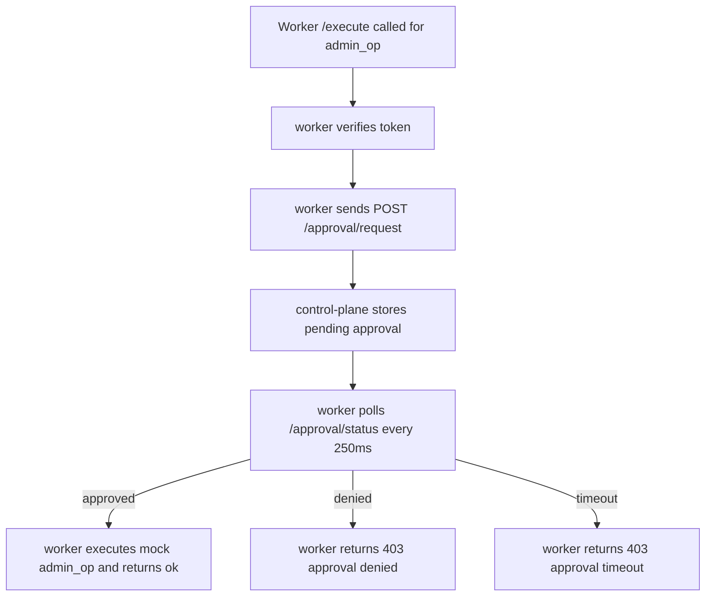

# PHASE 1.4 REPORT — Distributed Approval Center

## Scope Completed
- Added Approval API contract to shared proto (`ApprovalRequest`, `ApprovalRequestResponse`, `ApprovalDecisionRequest`, `ApprovalDecisionResponse`, `ApprovalStatusResponse`).
- Implemented HITL approval endpoints in control-plane:
  - `POST /approval/request`
  - `GET /approval/pending`
  - `POST /approval/decide`
  - `GET /approval/status?approval_id=...`
- Added approval registry with timeout handling and cleanup (`created -> approved/denied/timeout`) in control-plane.
- Added worker approval gating for red-level actions (`admin_op`) in `safeagent-worker`:
  - calls `/approval/request`
  - polls `/approval/status` every 250ms up to timeout
  - executes only on approved state
  - returns `approval denied` or `approval timeout` otherwise.
- Added verification coverage:
  - unit tests in control-plane (`create_approval` transitions + idempotent decisions)
  - integration tests for pending list + decision updates
  - e2e tests for:
    - red action approve flow
    - red action timeout flow

## Endpoints & Curl Samples

### approval.request
```bash
curl --silent --show-error --cacert platform/pki/ca.crt --cert platform/pki/worker.crt --key platform/pki/worker.key \
  -H 'content-type: application/json' \
  -d '{"approval_id":"uuid-1","request_id":"req-1","node_id":"worker-001","skill_id":"admin_op","input_summary":"admin action","reason":"human approval required","created_at":1739980000,"expires_at":1739980030}' \
  https://127.0.0.1:8443/approval/request
```

### approval.pending
```bash
curl --silent --show-error --cacert platform/pki/ca.crt --cert platform/pki/worker.crt --key platform/pki/worker.key \
  https://127.0.0.1:8443/approval/pending
```

### approval.decide
```bash
curl --silent --show-error --cacert platform/pki/ca.crt --cert platform/pki/worker.crt --key platform/pki/worker.key \
  -H 'content-type: application/json' \
  -d '{"approval_id":"uuid-1","decision":"approved","decided_by":"operator","reason":"policy allows"}' \
  https://127.0.0.1:8443/approval/decide
```

### approval.status
```bash
curl --silent --show-error --cacert platform/pki/ca.crt --cert platform/pki/worker.crt --key platform/pki/worker.key \
  'https://127.0.0.1:8443/approval/status?approval_id=uuid-1'
```

### flow diagram


## Test Results

### Unit (control-plane)
- `approval_store_created_to_approved`
- `approval_store_created_to_denied`
- `approval_store_created_to_timeout`
- `approval_store_double_approve_is_idempotent`

### Integration (control-plane)
- `approval_request_and_pending_list_and_decide`

### End-to-end (control-plane+worker)
- `red_action_waits_for_approval_then_executes` — PASS
- `red_action_timeout_is_rejected` — PASS

## approval-e2e PASS excerpt
```text
cargo test --manifest-path platform/control-plane/Cargo.toml --test mtls -- red_action_waits_for_approval_then_executes red_action_timeout_is_rejected --exact

running 2 tests
 test red_action_waits_for_approval_then_executes ... ok
 test red_action_timeout_is_rejected ... ok

test result: ok. 2 passed; 0 failed; 0 ignored; 0 measured; 5 filtered out
```

## verify-v2 PASS excerpt
```text
cargo fmt --all --check --manifest-path platform/control-plane/Cargo.toml
cargo fmt --all --check --manifest-path platform/worker/Cargo.toml
cargo fmt --all --check --manifest-path platform/shared/Cargo.toml
cargo clippy --manifest-path platform/control-plane/Cargo.toml --all-targets -- -D warnings
cargo clippy --manifest-path platform/worker/Cargo.toml --all-targets -- -D warnings
cargo clippy --manifest-path platform/shared/Cargo.toml --all-targets -- -D warnings
cargo test --manifest-path platform/control-plane/Cargo.toml
cargo test --manifest-path platform/worker/Cargo.toml
cargo test --manifest-path platform/shared/Cargo.toml
just mtls-smoke-v2
just approval-e2e-v2
```

- Full run result captured in `logs/verify_v2_phase_1_4.log`.

## mtls-smoke-v2 PASS evidence
```text
[control-plane] listen=127.0.0.1:8443 ca=platform/pki/ca.crt cert=platform/pki/control-plane.crt key=platform/pki/control-plane.key
[worker] control_plane=https://127.0.0.1:8443 ca=platform/pki/ca.crt cert=platform/pki/worker.crt key=platform/pki/worker.key addr=127.0.0.1:8280
[worker] registered node_id=001
```
